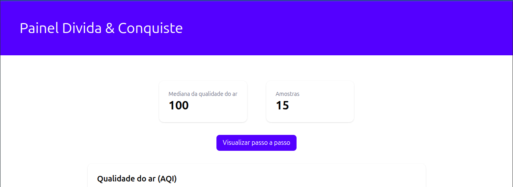
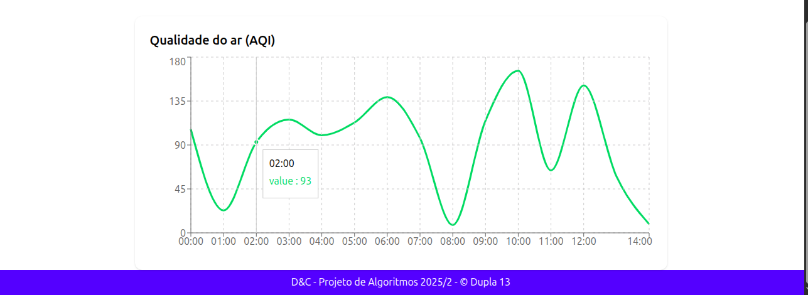
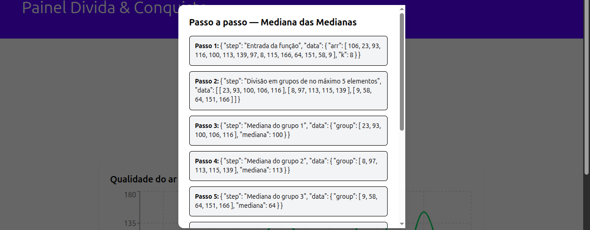

# DC_Projeto_Dupla13

**Número da Lista**: 4<br>
**Conteúdo da Disciplina**: D&C<br>

## Alunos
|Matrícula | Aluno |
| -- | -- |
| 222006490  |  Vinícius de Jesus Bessa Fernandes |
| 231011865  |  Willian Wagner Xavier Ramos da Silva |

## Sobre 
[Descreva os objetivos do seu projeto e como ele funciona. ]: #
O conteúdo de dividir e conquistar é a base do projeto que resultou em uma aplicação web para análise de qualidade do ar. Nela, o usuário pode visualizar dados coletados por sensores e acompanhar métricas importantes em tempo real. Contudo, por conta de limitações de API, é utilizado o algoritmo **Mediana das Medianas** para calcular a mediana de um conjunto de valores simulados de qualidade do ar em um período de tempo aleatório.<br><br>
O algoritmo divide o conjunto de dados em pequenos grupos, calcula a mediana de cada grupo e utiliza a mediana dessas medianas como pivô para particionar o conjunto. Dessa forma, a aplicação não apenas fornece a mediana, mas também permite visualizar todo o passo a passo do algoritmo.

## Screenshots
[Adicione 3 ou mais screenshots do projeto em funcionamento.]: #
### Dados numéricos da mediana e da amostra

### Gráfico da qualidade do ar em até 24 horas

### Explicação passo a passo do algoritmo


## Instalação
[**Linguagem**: xxxxxx<br>]: #
[**Framework**: (caso exista)]: #<br>
Linguagem: TypeScript;<br>
Biblioteca: React.js;<br>
Framework: Tailwind CSS, NextJS.

## Uso
[Explique como usar seu projeto caso haja algum passo a passo após o comando de execução.]: #
Para executar a aplicação, execute o seguinte comando:

```bash
cd divida-conquiste && npm install && npm run dev
```

## Vídeo
[Quaisquer outras informações sobre seu projeto podem ser descritas abaixo.]: #

[Vídeo de explicação do projeto](https://youtu.be/INkflZm_X1Y)
